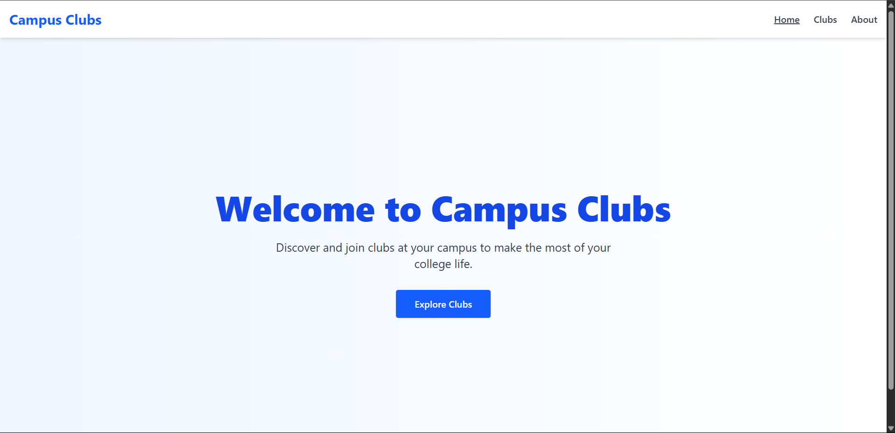
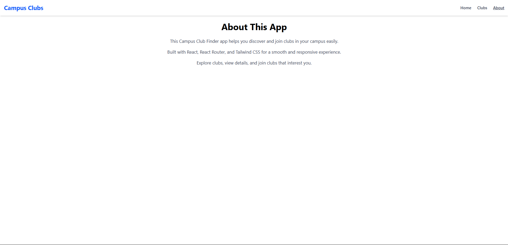

# 📘 Campus Club Finder – Documentation

## 📄 Overview

**Campus Club Finder** adalah aplikasi React yang memungkinkan mahasiswa melihat, menjelajahi, dan bergabung dengan klub yang tersedia di kampus mereka. Aplikasi ini responsif dan dibangun menggunakan React Router dan Tailwind CSS.

---

## 🏁 Initial State

Saat aplikasi pertama kali dibuka, pengguna akan melihat **Halaman Home** yang menyambut mereka dan menyediakan tombol untuk menuju ke daftar klub.

---

## 📍 Pages & Routing

| Route            | Page Name        | Deskripsi                                                                 |
|------------------|------------------|---------------------------------------------------------------------------|
| `/`              | Home             | Halaman utama, berisi hero section dan CTA menuju daftar klub            |
| `/clubs`         | Club List        | Daftar semua klub dengan opsi untuk sorting & tampilan grid/list         |
| `/clubs/:clubId` | Club Detail      | Halaman detail klub tertentu + tombol untuk join/leave klub              |
| `/about`         | About            | Penjelasan singkat tentang aplikasi dan teknologi yang digunakan         |
| `*`              | Not Found (404)  | Halaman fallback untuk route yang tidak ditemukan                        |

---

## 🧩 Components

### ✅ Navbar
- Tampil di semua halaman
- Menampilkan navigasi ke: Home, Clubs, About
- Highlight halaman aktif menggunakan styling Tailwind

### ✅ Home Page (`/`)
- Hero section dengan pesan selamat datang
- Deskripsi singkat aplikasi
- Tombol "Explore Clubs" menuju `/clubs`

### ✅ Club List Page (`/clubs`)
- Menampilkan 5 klub dari `clubs.js`
- Fitur:
  - Sorting:
    - Name A-Z
    - Name Z-A
  - View Toggle:
    - Grid View
    - List View
- Setiap kartu klub berisi:
  - Gambar
  - Nama
  - Deskripsi singkat
  - Tombol "View Details"
  - Tombol Join/Leave Club (tersimpan di localStorage)

### ✅ Club Detail Page (`/clubs/:clubId`)
- Gambar besar
- Nama klub
- Deskripsi lengkap
- Daftar event mendatang (minimal 2)
- Tombol “Join Club” atau notifikasi jika sudah join

### ✅ About Page (`/about`)
- Deskripsi aplikasi
- Tech stack:
  - React
  - React Router
  - Tailwind CSS
  - Vite

### ✅ Not Found Page (`*`)
- Pesan halaman tidak ditemukan
- Tombol kembali ke Home

---

## 💾 Local Storage

- Klub yang di-join akan disimpan di `localStorage` dengan key `joinedClubs`.
- Jika sudah bergabung, tombol akan berubah jadi "You have joined this club!"

---

## 📱 Responsiveness

Semua halaman menggunakan Tailwind CSS dan sudah diatur agar:
- Mobile-first
- Responsif di tablet & desktop
- Grid dan list disesuaikan secara dinamis

---

## 📸 Screenshots

> 💡 **Tambahkan gambar di bawah ini** menggunakan format berikut (setelah menempatkan gambar di folder `/screenshots`):

```md
### 🏠 Home Page


### 📃 Club List Page (Grid View)


### 📃 Club List Page (List View)


### 🔍 Club Detail Page


### ℹ️ About Page


### 🚫 404 Page

